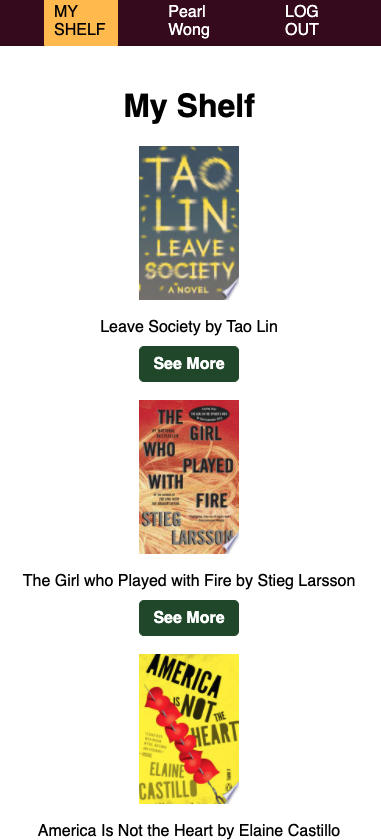

# Kanshu  
#### An app to track the books you've read!
This app utilizes Google Books API to allow all users to search for books by title, author, category, publisher, or isbn. Using OAuth to authenticate, authenticated users have access to their personal Shelf. They can view, add, edit, or remove books they've read. They can also view, add, edit, or delete reviews and notes.  
  
## Screenshots
  
  
  
## Technologies Used:
CSS  
Express  
JavaScript  
Google OAuth 2.0  
Heroku     
MongoDB / mongoose  
Node.js  
Passport  
  
## Getting Started:
[KanShu](https://kanshu.herokuapp.com)  
[Trello](https://trello.com/b/S220MMEg/pw-books-app)  
[Wireframe](https://www.figma.com/file/wo30ysZk8aMByX2jwf3V92/Books-Tracker-Wireframe?node-id=0%3A1)  
  
## Next Steps
- Add authenticated user-to-user interactions
- Add functionality for authenticated users to create and name multiple shelves / collections of books
- Add functionality to click and drag books to different shelves